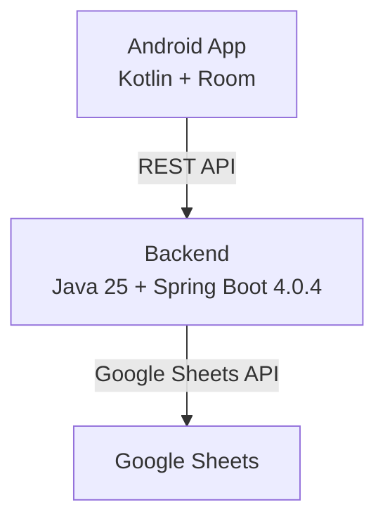
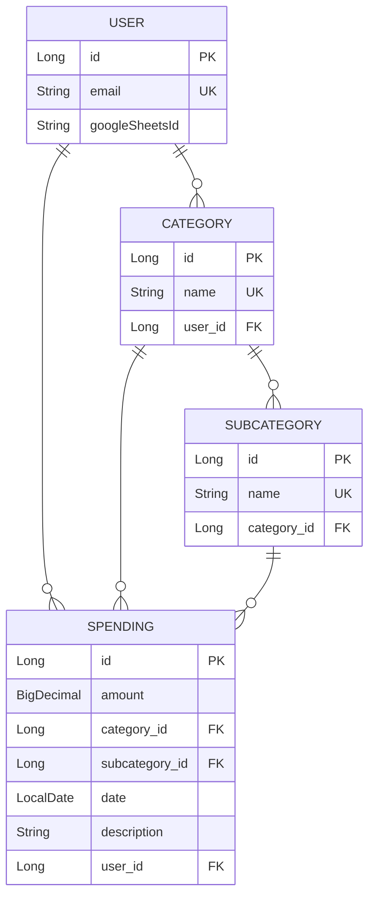

# AGENTS.md — Spending Tracker

Документ для AI-агентов. Здесь описана структура проекта, архитектура и ключевые соглашения.

---

## Описание проекта

**Spending Tracker** — приложение для учёта личных расходов с синхронизацией в Google Sheets.

- **Версия**: v0.0.1
- **Стадия**: MVP1
- **Назначение**: Мобильное приложение (Android) для фиксации расходов по категориям, просмотра сводок и синхронизации данных с облаком через REST API backend.

---

## Архитектура



### Backend (`backend/`)

Java 25 + Spring Boot 4.0.4, REST API, Spring Security, OAuth 2.0, JPA/H2, Maven

**Структура пакетов** (`spending.tracker.backend`):
- `config/` — конфигурация (Security, Web, Email Authentication Filter)
- `controller/` — REST контроллеры (User, Category, SubCategory, Spending)
- `dto/` — Request/Response DTOs
- `entity/` — JPA сущности (User, Category, SubCategory, Spending)
- `exception/` — обработка исключений
  - `handler/GlobalExceptionHandler.java` — единая точка обработки
  - `type/` — типы исключений
- `mapper/` — MapStruct мапперы (User, Category, SubCategory, Spending)
- `model/` — внутренние модели
- `repository/` — Spring Data JPA репозитории
- `service/` — бизнес-логика
  - `data/` — Data Services (доступ к данным)
- `validation/` — валидация email через header

**Аутентификация**: email передаётся в заголовке `X-User-Email`, валидируется через `ValidEmailHeader`

**API Endpoints** (Swagger: `http://localhost:8081/swagger-ui/index.html`):

| Модуль | Base URL | Описание |
|--------|----------|----------|
| User | `/api/v1/users` | Управление пользователями |
| Category | `/api/v1/categories` | Категории расходов |
| SubCategory | `/api/v1/subcategories` | Подкатегории |
| Spending | `/api/v1/spending` | Расходы |

### Frontend (Android) — в разработке

Kotlin + Room (SQLite) + Retrofit + MPAndroidChart

---

## Модель данных

### Entities



### Категории расходов (по умолчанию)

Продукты, еда, доставки | Авто и транспорт | Кредиты | Я | Услуги | Сигареты | Образование | Вредности | Кафе и рестораны, развлечения | Кошка | Квартира и обязательные платежи | Дом и уют | Работа, корпоративы | Подарки | Подписки | Вклад | Семья | Иное

### Категории доходов (по умолчанию)

Кешбеки | Налоговый вычет | Иные доходы | Зарплата

---

## Технологии

### Backend

| Компонент | Версия |
|-----------|-------|
| Java | 25 |
| Spring Boot | 4.0.4 |
| Lombok | 1.18.44 |
| MapStruct | 1.6.3 |
| SpringDoc OpenAPI | 3.0.3 |
| H2 Database | — |
| google-api-client | 2.9.0 |
| java-dotenv | 5.2.2 |

### Сборка и запуск

```bash
# Сборка
mvn clean install

# Запуск backend
mvn spring-boot:run

# Запуск тестов
mvn test
```

---

## Ключевые соглашения

### Паттерн Service Layer

```
Controller -> Service -> DataService -> Repository
                |
                v
             Mapper (MapStruct)
```

1. **Controller** — обработка HTTP, валидация, документация OpenAPI
2. **Service** — бизнес-логика, маппинг DTO -> Model
3. **DataService** — доступ к данным (find/save/update/delete)
4. **Mapper** — преобразование между слоями

### Обработка ошибок

Все исключения обрабатываются в `GlobalExceptionHandler`. Типы исключений в `exception/type/`:

- `ResourceNotFoundException` — ресурс не найден (404)
- `DuplicateEntityException` — дублирование (409)
- `DuplicateCategoryException` / `DuplicateSubCategoryException`
- `CategoryInUseException` / `SubCategoryInUseException` — удаление связанных сущностей
- `ForeignKeyException` — нарушение foreign key
- `InvalidEmailException` — некорректный email

### Тесты

- Базовый класс: `BaseSpringBootTest`
- Тесты контроллеров: `*ControllerTest.java`
- Тестовые утилиты: `TestDataUtils.java`

---

## Планы разработки

Документация в `.plans/`:
- [`global_plan.md`](.plans/global_plan.md) — общий план
- [`category_refactoring_plan.md`](.plans/category_refactoring_plan.md) — рефакторинг категорий
- [`subcategory_plan.md`](.plans/subcategory_plan.md) — подкатегории
- [`dto_module_refactoring_plan.md`](.plans/dto_module_refactoring_plan.md) — рефакторинг DTO
- [`exception_handling_plan.md`](.plans/exception_handling_plan.md) — обработка ошибок
- [`email_validation_plan.md`](.plans/email_validation_plan.md) — валидация email

---

## Полезные ссылки

- Swagger UI: `http://localhost:8081/swagger-ui/index.html`
- H2 Console: `http://localhost:8081/h2-console` (если настроено)