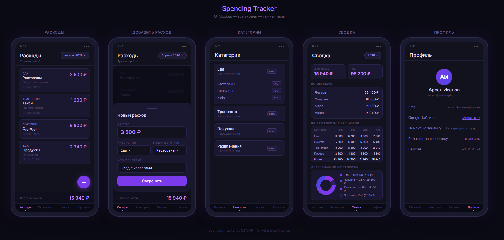

# Spending Tracker

Приложение для учёта личных расходов с синхронизацией в Google Sheets.

**Версия**: v0.0.1 (MVP1)



## Архитектура

```
Android (Kotlin) → REST API (Java 25/Spring Boot) → Google Sheets
```

## Запуск

```bash
# Backend
cd backend && mvn spring-boot:run

# Swagger UI
http://localhost:8081/swagger-ui/index.html
```

## Подробности

См. [AGENTS.md](AGENTS.md) для полной документации.

## Модули проекта

| Модуль | Статус | GitHub                    |
|--------|--------|---------------------------|
| `backend` | ✅ Готов | https://github.com/Terpsihoransk/spending_tracker |
| `android` | ✅ Готов | https://github.com/Terpsihoransk/spending-tracker-android |

## Технологии

### Backend

| Компонент | Версия |
|-----------|-------|
| Java | 25 |
| Spring Boot | 4.0.4 |
| Lombok | 1.18.44 |
| MapStruct | 1.6.3 |
| SpringDoc OpenAPI | 3.0.3 |
| H2 Database | — |
| google-api-client | 2.9.0 |
| java-dotenv | 5.2.2 |

## API Спецификация

Полная спецификация REST API (контроллеры, методы, DTO, примеры запросов/ответов) описана в файле [api_specification.md](documentation/api_specification.md)[API_SPECIFICATION.md](API_SPECIFICATION.md).

Краткий обзор эндпоинтов:

| Модуль | Метод | Эндпоинт | Описание |
|--------|-------|----------|----------|
| User | POST | `/api/v1/user` | Создать пользователя |
| User | GET | `/api/v1/user` | Получить всех пользователей |
| Category | GET | `/api/v1/categories` | Получить категории |
| Category | POST | `/api/v1/categories` | Создать категорию |
| Category | PUT | `/api/v1/categories/{id}` | Обновить категорию |
| Category | DELETE | `/api/v1/categories/{id}` | Удалить категорию |
| SubCategory | GET | `/api/v1/subcategories` | Получить подкатегории |
| SubCategory | POST | `/api/v1/subcategories` | Создать подкатегорию |
| SubCategory | PUT | `/api/v1/subcategories/{id}` | Обновить подкатегорию |
| SubCategory | DELETE | `/api/v1/subcategories/{id}` | Удалить подкатегорию |
| Spending | GET | `/api/v1/spending` | Получить расходы |
| Spending | POST | `/api/v1/spending` | Создать расход |
| Spending | PUT | `/api/v1/spending/{id}` | Обновить расход |
| Spending | DELETE | `/api/v1/spending/{id}` | Удалить расход |

Все запросы (кроме создания пользователя) требуют заголовок `X-User-Email`.  
Swagger UI: `http://localhost:8081/swagger-ui/index.html`

---

## Общие коды ошибок

| Код | Описание |
|-----|----------|
| `400` | Bad Request — ошибки валидации входных данных |
| `404` | Not Found — ресурс не найден |
| `409` | Conflict — дублирование имени или нарушение ограничений (категория используется) |