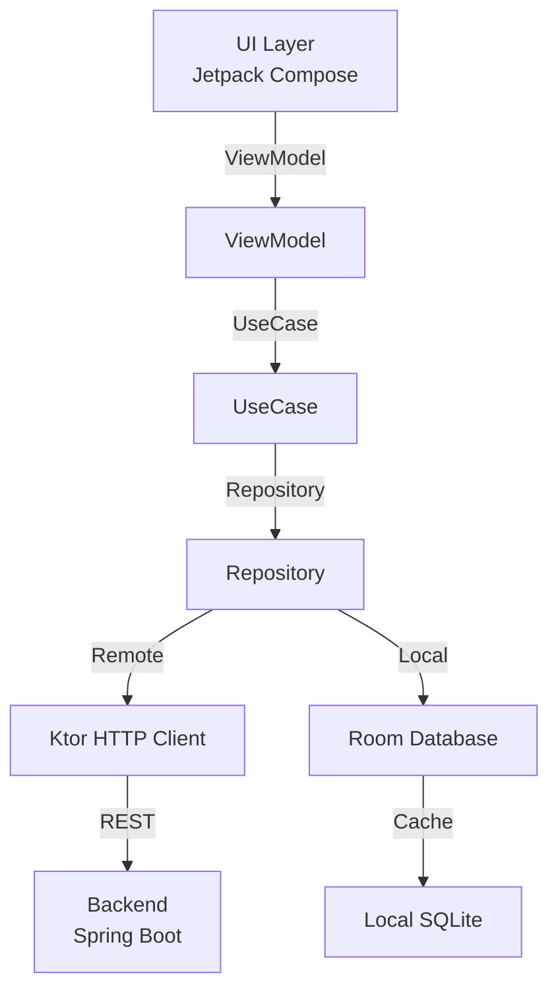

# План создания Android приложения (Kotlin + Jetpack Compose)

## Описание

Создание Android приложения в папке `android/` с Gradle сборкой. Приложение для учёта расходов с REST API интеграцией к backend.

## Целевая структура проекта

```
spending_tracker/
├── pom.xml              # Родительский Maven (для backend)
├── backend/             # Существующий Java Spring Boot
├── android/             # НОВЫЙ Android Kotlin модуль
│   ├── build.gradle.kts  # AGP конфигурация
│   ├── settings.gradle.kts
│   ├── gradle.properties
│   └── app/
│       ├── build.gradle.kts
│       └── src/
│           └── main/
│               ├── kotlin/
│               └── res/
```

## Технологии

| Компонент | Версия |
|-----------|--------|
| Kotlin | 2.1.0 |
| JVM | 25 |
| AGP | 8.7.3 |
| Gradle | 8.11.1 |
| Jetpack Compose BOM | 2024.12.01 |
| Room | 2.6.1 |
| Koin | 4.0.0 |
| Ktor Client | 3.0.2 |
| Kotlin Serialization | 1.7.3 |
| Coroutines | 1.9.0 |
| Navigation Compose | 2.8.5 |
| Material 3 | 1.3.1 |

## Архитектура



## Этапы реализации

### Этап 1: Создание структуры модуля

- [ ] Создать папку `android/`
- [ ] Создать `android/settings.gradle.kts`
- [ ] Создать `android/build.gradle.kts` (root)
- [ ] Создать `android/gradle.properties`
- [ ] Создать `android/gradle/wrapper/`
- [ ] Создать `android/app/build.gradle.kts`
- [ ] Настроить parent `pom.xml` для включения android как module (опционально)

### Этап 2: Базовая конфигурация

- [ ] Настроить AGP с jvmTarget 25
- [ ] Настроить Compose compiler
- [ ] Создать базовую структуру пакетов `spending.tracker.android`
- [ ] Создать `MainActivity` с Compose
- [ ] Создать `SpendingTrackerApp` (Application class)

### Этап 3: Зависимости

- [ ] Добавить Jetpack Compose BOM
- [ ] Добавить Ktor client для HTTP
- [ ] Добавить Room для локальной БД
- [ ] Добавить Koin для DI
- [ ] Добавить kotlinx-serialization
- [ ] Добавить Coroutines
- [ ] Добавить Navigation Compose

### Этап 4: Структура приложения (Clean Architecture)

```
spending.tracker.android/
├── di/                      # Koin модули
├── data/
│   ├── local/               # Room база, DAOs, Entities
│   ├── remote/              # Ktor клиент, API сервисы, DTOs
│   └── repository/          # Repository implementations
├── domain/
│   ├── model/               # Domain models
│   ├── repository/          # Repository interfaces
│   └── usecase/             # Use cases
├── presentation/
│   ├── navigation/          # Navigation routes
│   ├── theme/               # Material 3 theme
│   ├── components/          # Reusable UI components
│   ├── screen/
│   │   ├── spending/        # Spending list/add/edit
│   │   ├── category/        # Category management
│   │   ├── summary/         # Summary/charts
│   │   └── settings/        # Settings
│   └── viewmodel/           # ViewModels
└── util/                    # Extensions, Constants
```

### Этап 5: API интеграция

- [ ] Создать DTO для Category, SubCategory, Spending, User
- [ ] Создать Ktor HTTP client
- [ ] Реализовать API services (CategoryApi, SpendingApi, etc.)
- [ ] Добавить auth header (X-User-Email)

### Этап 6: Локальное хранение

- [ ] Создать Room Entities
- [ ] Создать DAOs
- [ ] Создать Database
- [ ] Настроить Repository pattern с offline-first

### Этап 7: UI экраны

- [ ] Главный экран со списком расходов
- [ ] Экран добавления/редактирования расхода
- [ ] Экран категорий
- [ ] Экран сводок (опционально)
- [ ] Навигация

## Пример build.gradle.kts (app)

```kotlin
plugins {
    alias(libs.plugins.android.application)
    alias(libs.plugins.kotlin.android)
    alias(libs.plugins.kotlin.compose)
    alias(libs.plugins.kotlin.serialization)
    id("com.google.devtools.ksp") version "2.1.0-1.0.28"
}

android {
    namespace = "spending.tracker.android"
    compileSdk = 35

    defaultConfig {
        applicationId = "spending.tracker.android"
        minSdk = 26
        targetSdk = 35
        versionCode = 1
        versionName = "1.0.0"
    }

    buildFeatures {
        compose = true
    }

    compileOptions {
        sourceCompatibility = JavaVersion.VERSION_25
        targetCompatibility = JavaVersion.VERSION_25
    }

    kotlinOptions {
        jvmTarget = "25"
    }
}

dependencies {
    // Compose BOM
    val composeBom = platform("androidx.compose:compose-bom:2024.12.01")
    implementation(composeBom)

    // Compose
    implementation("androidx.compose.ui:ui")
    implementation("androidx.compose.material3:material3")
    implementation("androidx.compose.material:material-icons-extended")
    implementation("androidx.activity:activity-compose:1.9.3")
    implementation("androidx.lifecycle:lifecycle-viewmodel-compose:2.8.7")
    implementation("androidx.navigation:navigation-compose:2.8.5")

    // Room
    implementation("androidx.room:room-runtime:2.6.1")
    implementation("androidx.room:room-ktx:2.6.1")
    ksp("androidx.room:room-compiler:2.6.1")

    // Koin
    implementation("io.insert-koin:koin-android:4.0.0")
    implementation("io.insert-koin:koin-androidx-compose:4.0.0")

    // Ktor
    implementation("io.ktor:ktor-client-core:3.0.2")
    implementation("io.ktor:ktor-client-android:3.0.2")
    implementation("io.ktor:ktor-client-content-negotiation:3.0.2")
    implementation("io.ktor:ktor-serialization-kotlinx-json:3.0.2")

    // Kotlinx Serialization
    implementation("org.jetbrains.kotlinx:kotlinx-serialization-json:1.7.3")

    // Coroutines
    implementation("org.jetbrains.kotlinx:kotlinx-coroutines-android:1.9.0")
}
```

## Следующие шаги

1. Подтвердить план и приступить к реализации
2. Создать базовую структуру модуля с Gradle
3. Настроить Compose и dependencies
4. Проверить сборку `gradle assembleDebug`
5. Реализовать Clean Architecture слои
6. Добавить API интеграцию
7. Создать UI экраны