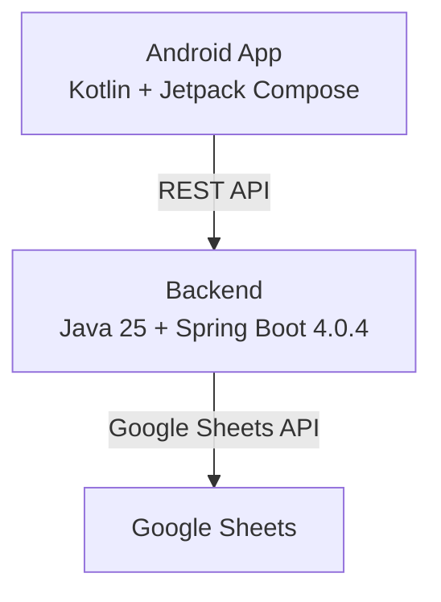

# Глобальный план разработки

## Обзор

**Spending Tracker** — приложение для учёта личных расходов с синхронизацией в Google Sheets.

- **Версия**: v0.0.1
- **Стадия**: MVP1

## Модули проекта

| Модуль | Статус | Описание |
|--------|--------|----------|
| `backend/` | ✅ Готов | Java Spring Boot REST API |
| `android/` | 📋 В разработке | Kotlin Android приложение |

## Технологии

### Backend

| Компонент | Версия |
|-----------|-------|
| Java | 25 |
| Spring Boot | 4.0.4 |
| Lombok | 1.18.44 |
| MapStruct | 1.6.3 |
| SpringDoc OpenAPI | 3.0.3 |
| H2 Database | — |
| google-api-client | 2.9.0 |
| java-dotenv | 5.2.2 |

### Android

| Компонент | Версия |
|-----------|-------|
| Kotlin | 2.1.0 |
| JVM | 25 |
| AGP | 8.7.3 |
| Gradle | 8.11.1 |
| Jetpack Compose BOM | 2024.12.01 |
| Room | 2.6.1 |
| Koin | 4.0.0 |
| Ktor Client | 3.0.2 |

## Планы по модулям

| План | Файл | Описание |
|------|------|----------|
| Android | [android_kotlin_plan.md](android_kotlin_plan.md) | Создание Android приложения |
| Backend | [refactoring_plan_back.md](refactoring_plan_back.md) | Рефакторинг backend |
| Категории | [category_refactoring_plan.md](category_refactoring_plan.md) | Рефакторинг категорий |
| Подкатегории | [subcategory_plan.md](subcategory_plan.md) | Подкатегории |
| DTO | [dto_module_refactoring_plan.md](dto_module_refactoring_plan.md) | Рефакторинг DTO модуля |
| Обработка ошибок | [exception_handling_plan.md](exception_handling_plan.md) | Обработка исключений |
| Email валидация | [email_validation_plan.md](email_validation_plan.md) | Валидация email |
| Google Sheets | [google_sheets_integration_plan.md](../../.plans/google_sheets_integration_plan.md) | Интеграция с Google Sheets |

## Следующие шаги

1. **Android модуль** — создать базовую структуру с Gradle и Compose
2. Продолжить интеграцию с Google Sheets в backend