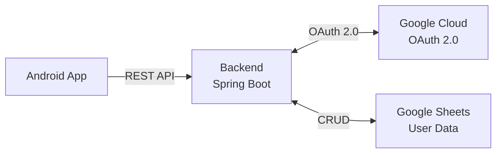
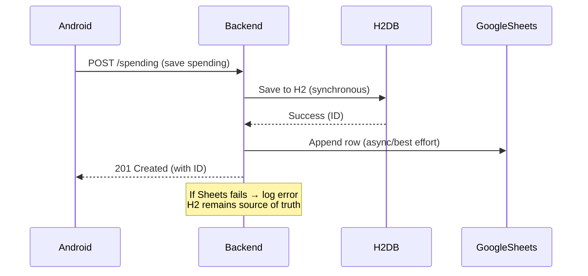
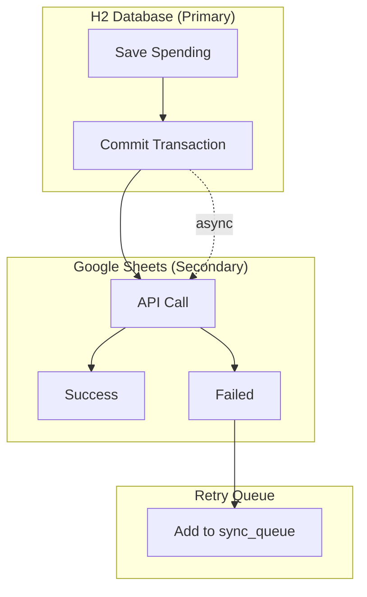

# План интеграции Google Sheets API

## Обзор архитектуры



## API google sheets

https://developers.google.com/workspace/sheets/api/guides/concepts?hl=ru

## Принцип работы OAuth 2.0 для Google Sheets

1. **Access Token** — короткоживущий токен (обычно 1 час), даёт доступ к API
2. **Refresh Token** — долгоживущий токен, используется для получения нового Access Token
3. В Google Sheets API **refresh_token выдаётся однократно** при первом разрешении пользователя

## Этапы интеграции

### 1. Настройка Google Cloud Console
- [ ] Создать проект в Google Cloud Console
- [ ] Включить Google Sheets API
- [ ] Создать OAuth 2.0 Client ID (Web application)
- [ ] Добавить разрешённые URIs перенаправления
- [ ] Получить `client_id` и `client_secret`

### 2. Расширение модели User
- [ ] Добавить поле `googleAccessToken` в User entity
- [ ] Добавить поле `googleRefreshToken` в User entity
- [ ] Добавить поле `tokenExpiry` (время истечения access token)

### 3. Создание Google Sheets Service
- [ ] Создать `GoogleSheetsConfig` — конфигурация OAuth клиента
- [ ] Создать `GoogleAuthService` — управление токенами, получение/обновление access token
- [ ] Создать `GoogleSheetsService` — CRUD операции с таблицами

### 4. Реализация OAuth Flow
- [ ] Создать endpoint `/api/v1/auth/google` — начало авторизации
- [ ] Создать endpoint `/api/v1/auth/google/callback` — обработка callback
- [ ] Сохранить refresh_token в базе данных - H2 и системная google sheets

### 5. Синхронизация данных
- [ ] Определить структуру таблицы (листы, столбцы)
- [ ] Создать endpoint для принудительной синхронизации
- [ ] Добавить автоматическую синхронизацию при CRUD операциях

### 6. Обработка ошибок и транзакции
- [ ] Обработка истёкшего access token (автоматическое обновление)
- [ ] Обработка истёкшего refresh token (повторная авторизация)
- [ ] Логирование ошибок синхронизации
- [ ] Стратегия "best effort" для синхронизации
- [ ] При успешном добавлении записи в google sheets, удаление её из H2

## Синхронизация данных: Стратегия и API вызовы

### Принцип синхронизации

Google Sheets API **не поддерживает транзакции** в традиционном понимании. Поэтому используем стратегию **"best effort"** с асинхронной синхронизацией.



### Google Sheets API: Добавление строки

**Метод:** `spreadsheets.values.append`

```java
// Пример вызова Google Sheets API
Values values = sheetsService.spreadsheets().values();
AppendRequest<AppendValuesResponse> appendRequest = values.append(
    spreadsheetId,           // ID таблицы из User.googleSheetsId
    "A:E",                  // Диапазон (лист и столбцы)
    new ValueInputOption("USER_ENTERED")  // Как интерпретировать данные
);

// Тело запроса — список строк
List<List<Object>> rows = List.of(
    List.of(id, date, category, subcategory, amount, description)
);

appendRequest.setRequestBody(new RequestBody().setValues(rows));
AppendValuesResponse response = appendRequest.execute();
```

**Ответ:**
```json
{
  "spreadsheetId": "1BxiMVs0XRA5nM...",
  "tableRange": "Sheet1!A1:E1000",
  "updates": {
    "spreadsheetId": "1BxiMVs0XRA5nM...",
    "updatedRange": "Sheet1!A1001:E1001",
    "updatedRows": 1,
    "updatedCells": 5
  }
}
```

### Стратегия "Best Effort"

| Ситуация | Поведение |
|----------|----------|
| Google Sheets доступен | Синхронизация успешна |
| Google Sheets недоступен | Запись в H2, логирование ошибки, пометка в очереди на retry |
| Access token истёк | Автоматическое обновление через refresh_token |
| Refresh token истёк | Пользователю нужно повторно авторизоваться |

### Очередь синхронизации (опционально для MVP2+)

Для обработки ошибок используем таблицу `sync_queue`:

| Полец | Тип | Описание |
|-------|-----|----------|
| id | Long | PK |
| entity_type | String | SPENDING, CATEGORY, etc. |
| entity_id | Long | ID записи |
| operation | String | CREATE, UPDATE, DELETE |
| status | String | PENDING, FAILED, COMPLETED |
| retry_count | Integer | Количество попыток |
| created_at | Timestamp | Время создания |

### Откат транзакций

Поскольку H2 — primary, а Google Sheets — secondary:

1. **H2 транзакция фиксируется первой** (синхронно)
2. **Google Sheets обновляется второй** (асинхронно, best effort)
3. **В случае ошибки Sheets:** запись попадает в `sync_queue` для retry



### Обновление/удаление в Google Sheets

**Обновление строки** — поиск по ID в столбце A:
```java
// Найти строку по ID
ValueRange response = sheetsService.spreadsheets().values()
    .get(spreadsheetId, "A:A")
    .execute();

// Обновить строку
BatchUpdateRequest updateRequest = new BatchUpdateRequest();
updateRequest.setData(new UpdateData(range, new ValueInputOption("USER_ENTERED")));
```

**Удаление строки** — используем `spreadsheets.values.batchClear` после поиска

## Структура Google Sheets

### Лист "Расходы"
| Столбец | Данные |
|---------|--------|
| A | ID записи (Long, из H2 базы) |
| B | Дата |
| C | Категория |
| D | Подкатегория |
| E | Сумма |
| F | Описание |

> **Примечание:** Используется Long ID из H2 базы данных, так как Google Sheets — вторичное хранилище. UUID не требуется, так как система не распределённая.

### Лист "Категории"
| Столбец | Данные |
|---------|--------|
| A | ID категории |
| B | Название |
| C | Подкатегории |

## Файловая структура

```
backend/src/main/java/spending/tracker/backend/
├── config/
│   └── GoogleSheetsConfig.java          # Конфигурация OAuth
├── service/
│   ├── GoogleAuthService.java            # Управление токенами
│   └── GoogleSheetsService.java         # Операции с таблицами
└── controller/
    └── AuthController.java              # OAuth endpoints
```

## Зависимости (pom.xml)

Добавить зависимости:
```xml
<dependency>
    <groupId>com.google.apis</groupId>
    <artifactId>google-api-services-sheets</artifactId>
    <version>v4-rev20220927-2.0.0</version>
</dependency>
<dependency>
    <groupId>com.google.http-client</groupId>
    <artifactId>google-http-client-jackson2</artifactId>
    <version>1.43.3</version>
</dependency>
```

## API Endpoints

| Метод | Endpoint | Описание |
|-------|----------|----------|
| GET | `/api/v1/auth/google` | Начало OAuth авторизации |
| GET | `/api/v1/auth/google/callback` | Callback после авторизации |
| POST | `/api/v1/spending/sync` | Принудительная синхронизация |
| GET | `/api/v1/spending/sync/status` | Статус синхронизации |

## Конфигурация (application.yml)

```yaml
google:
  sheets:
    client-id: ${GOOGLE_CLIENT_ID}
    client-secret: ${GOOGLE_CLIENT_SECRET}
    redirect-uri: http://localhost:8081/api/v1/auth/google/callback
    scopes: https://www.googleapis.com/auth/spreadsheets
```